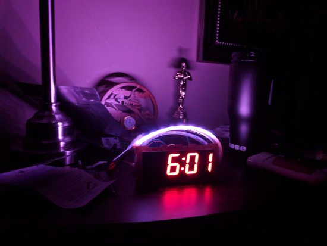

# AlarmClock
Arduino based RTC Sunrise Alarm Clock

This project is to create a clock that lights up as an artificial sunrise to wake you up in the morning.

## Hardware
This is the hardware that I used to build this project, all of which can be obtained on Adafruit:

- Adafruit [ItsyBitsy](https://www.adafruit.com/product/3677)
- [PCF8523 RTC](https://www.adafruit.com/product/3295)
- [7 segment Display w/ Backpack](https://www.adafruit.com/product/1270)
- Tactile [Buttons](https://www.adafruit.com/product/3101)
- NeoPixel (There's a ton of options. I used [this](https://www.adafruit.com/product/3811) for my prototype.)

You can pretty easily swap any of these components out for other similar products. Be advised that some changes may also be reqired in the software.

## Software 
[Arduino Sketch](https://github.com/Matlock42/AlarmClock/blob/master/AlarmClock_12hr_millis.ino)
